<h1 style="text-align: center;">Informe Inicial del Primer Sprint</h1>

<h2>Objetivos</h2>

Informe las actividades del equipo hasta el momento y demuestre que el equipo ha estado trabajando para completar el primer sprint.

<h2>Nombre del equipo: Kapumota</h2>
<h2>Miembros del equipo:</h2>
<ul>
    <li>Reeves Goñi David Fernando</li>
    <li>Ruiz Arica Milagros Cristina</li>
    <li>Ravichagua Marin José Manuel</li>
</ul>
<h2>Acta de reunion:</h2>
<table border="3" cellpadding="10">
    <tr>
        <th> Fecha </th>
        <th> Tiempo y   duracion </th>
        <th> Lugar </th>
        <th>Nombres de los participantes</th>
        <th>Proposito de la reunion</th>
        <th>Elementos de accion especificos</th>
    </tr>
    <tr>
        <td style="text-align: center;">23/03/2024</td>
        <td style="text-align: center;">2 horas</td>
        <td> Reunion virtual por Google Meet</td>
        <td>
            <ul>
                <li>Ravichagua Manuel</li>
                <li>Reeves David</li>
                <li>Ruiz Milagros</li>
            </ul>
        </td>
        <td>
            <ul>
                <li>Investigar acerca del juego de las damas americanas</li>
                <li>Definir las tecnologias y metodologias que utiliza para el proyecto</li>
            </ul>
        </td>
        <td>
            <ul>
                <li>Definir roles y responsabilidades</li>
                <li>Establer un sistema de comunicacion</li>
            </ul>
        </td>
    </tr>
    <tr>
        <td>25/03/2024</td>
        <td>15 min</td>
        <td>Reunion virtual por Google Meet</td>
        <td>
            <ul>
                <li>Ravichagua Manuel</li>
                <li>Reeves David</li>
                <li>Ruiz Milagros</li>
            </ul>
        </td>
        <td>
            <ul>
                <li>Determinar los requerimientos y especificaciones</li>
            </ul>
        </td>
        <td>
            <ul>
                <li>Modificar el estado actual</li>
                <li>Utilizar la técnica GWT para definir las especificaciones y requerimientos del software</li>
            </ul>
        </td>
    </tr>
    <tr>
        <td>26/03/2024</td>
        <td>15 min</td>
        <td>Reunion presencial en la Universidad</td>
        <td>
            <ul>
                <li>Ravichagua Manuel</li>
                <li>Reeves David</li>
                <li>Ruiz Milagros</li>
            </ul>
        </td>
        <td>
            <ul>
                <li>Determina el flujo de ejecución que tendrá el software</li>
            </ul>
        </td>
        <td>
            <ul>
                <li>Designar las tareas para realizar el flujo de ejecución del software</li>
                <li>Crear un mirror compartido</li>
            </ul>
        </td>
    </tr>
    <tr>
        <td>28/03/2024</td>
        <td>15 min</td>
        <td>Reunion virtual por Google Meet</td>
        <td>
            <ul>
                <li>Ravichagua Manuel</li>
                <li>Reeves David</li>
                <li>Ruiz Milagros</li>
            </ul>
        </td>
        <td>
            <ul>
                <li>Definir la arquitectura del software</li>
                <li>Terminar el flujo de ejecución del software</li>
            </ul>
        </td>
        <td>
            <ul>
                <li>Utilizar los requerimientos y especificaciones</li>
                <li>Comparar diversos tipos de arquitecturas</li>
                <li>Establecer la arquitectura a usar de cliente-servidor de 3 capas</li>
            </ul>
        </td>
    </tr>
    <tr>
        <td>08/04/2024</td>
        <td>15 min</td>
        <td>Reunion virtual por Google Meet</td>
        <td>
            <ul>
                <li>Ravichagua Manuel</li>
                <li>Reeves David</li>
                <li>Ruiz Milagros</li>
            </ul>
        </td>
        <td>
            <ul>
                <li>Elaboracion de la api rest</li>
            </ul>
        </td>
        <td>
            <ul>
                <li>Definir los metodos http</li>
                <li>Decidir si encriptamos las contrasenas</li>
                <li>Definir la base de datos que usaremos</li>
            </ul>
        </td>
    </tr>
    <tr>
        <td>10/04/2024</td>
        <td>15 min</td>
        <td>Reunion virtual por Google Meet</td>
        <td>
            <ul>
                <li>Ravichagua Manuel</li>
                <li>Reeves David</li>
                <li>Ruiz Milagros</li>
            </ul>
        </td>
        <td>
            <ul>
                <li>Finalizacion del registro de usuario</li>
            </ul>
        </td>
        <td>
            <ul>
                <li>Conectar la api rest con el front end</li>
                <li>Comentar el avance back end y front end</li>
                <li>Continuar con el log in</li>
            </ul>
        </td>
    </tr>
    <tr>
        <td>15/04/2024</td>
        <td>15 min</td>
        <td>Reunion virtual por Google Meet</td>
        <td>
            <ul>
                <li>Reeves David</li>
                <li>Ruiz Milagros</li>
            </ul>
        </td>
        <td>
            <ul>
                <li>Finalizacion del log in</li>
            </ul>
        </td>
        <td>
            <ul>
                <li>Hacer que el log in funcione en el front end</li>
                <li>Comentar el avance del backend y frontend</li>
                <li>Designar las tareas para la elaboracion del juego</li>
            </ul>
        </td>
    </tr>
    <tr>
        <td>18/04/2024</td>
        <td>45 min</td>
        <td>Reunion virtual por Google Meet</td>
        <td>
            <ul>
                <li>Andrei Trujillo</li>
                <li>Reeves David</li>
                <li>Ruiz Milagros</li>
            </ul>
        </td>
        <td>
            <ul>
                <li>Inclusion de Andrei al equipo</li>
            </ul>
        </td>
        <td>
            <ul>
                <li>Incorporar a Andrei al equipo debido a que Manuel se retiro</li>
                <li>Poner al dia a Andrei en el avance del proyecto</li>
                <li>Asinarle tareas a Andrei</li>
            </ul>
        </td>
    </tr>
    <tr>
        <td>19/04/2024</td>
        <td>20 min</td>
        <td>Reunion virtual por Google Meet</td>
        <td>
            <ul>
                <li>Andrei Trujillo</li>
                <li>Reeves David</li>
                <li>Ruiz Milagros</li>
            </ul>
        </td>
        <td>
            <ul>
                <li>Visualizacion del tablero</li>
            </ul>
        </td>
        <td>
            <ul>
                <li>Mostrar el tablero cuando el usuario inicia sesion</li>
                <li>Planear como haremos e implementaremos la logica del juego</li>
            </ul>
        </td>
    </tr>
    <tr>
        <td>23/04/2024</td>
        <td>15 min</td>
        <td>Reunion virtual por Google Meet</td>
        <td>
            <ul>
                <li>Andrei Trujillo</li>
                <li>Reeves David</li>
                <li>Ruiz Milagros</li>
            </ul>
        </td>
        <td>
            <ul>
                <li>Finalizacion de cierre de sesion</li>
            </ul>
        </td>
        <td>
            <ul>
                <li>Finalizamos con el cierre de sesion</li>
                <li>Comentamos el avance en el backend y frontend</li>
            </ul>
        </td>
    </tr>
    <tr>
        <td>24/04/2024</td>
        <td>15 min</td>
        <td>Reunion virtual por Google Meet</td>
        <td>
            <ul>
                <li>Andrei Trujillo</li>
                <li>Reeves David</li>
                <li>Ruiz Milagros</li>
            </ul>
        </td>
        <td>
            <ul>
                <li>Comenzar con el testing del backend</li>
            </ul>
        </td>
        <td>
            <ul>
                <li>Comenzamos con el testing del backend</li>
                <li>Planeamos a que clase le aplicaremos cual metodo de testing</li>
                <li>Seguimos avanzando con la logica del juego</li>
            </ul>
        </td>
    </tr>
    <tr>
        <td>25/03/2024</td>
        <td>15 min</td>
        <td>Reunion virtual por Google Meet</td>
        <td>
            <ul>
                <li>Ravichagua Manuel</li>
                <li>Reeves David</li>
                <li>Ruiz Milagros</li>
            </ul>
        </td>
        <td>
            <ul>
                <li>Determinar los requerimientos y especificaciones</li>
            </ul>
        </td>
        <td>
            <ul>
                <li>Modificar el estado actual</li>
                <li>Utilizar la técnica GWT para definir las especificaciones y requerimientos del software</li>
            </ul>
        </td>
    </tr>
    <tr>
        <td>26/04/2024</td>
        <td>30 min</td>
        <td>Reunion virtual por Google Meet</td>
        <td>
            <ul>
                <li>Andrei Trujillo</li>
                <li>Reeves David</li>
                <li>Ruiz Milagros</li>
            </ul>
        </td>
        <td>
            <ul>
                <li>Finalizacion del testing del backend</li>
            </ul>
        </td>
        <td>
            <ul>
                <li>Terminamos el testing para las clases en el backend</li>
                <li>Tomamos mas importancia a las historias de usuario y criterios de aceptacion</li>
            </ul>
        </td>
    </tr>
    <tr>
        <td>27/04/2024</td>
        <td>25 min</td>
        <td>Reunion virtual por Google Meet</td>
        <td>
            <ul>
                <li>Andrei Trujillo</li>
                <li>Reeves David</li>
                <li>Ruiz Milagros</li>
            </ul>
        </td>
        <td>
            <ul>
                <li>Finalizacion de la logica del juego y empezar a refactorizar</li>
            </ul>
        </td>
        <td>
            <ul>
                <li>Mostramos la logica del juego</li>
                <li>Planeamos como implementarlo en el tablero</li>
                <li>Empezamos a refactorizar el backend</li>
            </ul>
        </td>
    </tr>
    <tr>
        <td>28/03/2024</td>
        <td>15 min</td>
        <td>Reunion virtual por Google Meet</td>
        <td>
            <ul>
                <li>Andrei Trujillo</li>
                <li>Reeves David</li>
                <li>Ruiz Milagros</li>
            </ul>
        </td>
        <td>
            <ul>
                <li>Finalizar con la implementacion de la logica del juego y refactorizacion</li>
            </ul>
        </td>
        <td>
            <ul>
                <li>Terminamos de implementar la logica del juego</li>
                <li>Terminamos de refactorizar el backend</li>
            </ul>
        </td>
    </tr>
</table>

<h3>Decisiones Clave:</h3>
<ul>
    <li>Lenguaje de programación: Java</li>
    <li>Guía de estilo de programación: Guía de Estilo de Google Java</li>
    <li>IDE: Intellij IDEA</li>
    <li>Sitio de alojamiento del proyecto: GitHub</li>
    <li>Horario habitual de reunión: 7:00 p.m.</li>
</ul>
<h2>Estado Actual: </h2>

<table border="3" cellpadding="10">
    <tr>
        <th>Tareas</th>
        <th>¿Qué se hace?</th>
        <th>¿Quién ha contribuido?</th>
    </tr>
    <tr>
        <td style="text-align: center;">Historias de usuarios</td>
        <td>Como nuevo usuario, necesito crear una cuenta para poder iniciar sesión</td>
        <td>
            <ul>
                <li>Ruiz Milagros</li>
                <li>Ravichagua Manuel</li>
                <li>Reeves David</li>
            </ul>
        </td>
    </tr>
    <tr>
        <td style="text-align: center;">Criterios de aceptación</td>
        <td>
            <ol>
                <li>
                    
Creación exitosa de una cuenta de usuario válida

                    <b>Dado</b> un nombre de usuario válido inexistente  
                    <b>Cuando</b> creo una cuenta con este nombre usuario  
                    <b>Y</b> una contraseña válida que coincida con la contraseña confirmada  
                    <b>Y</b> una direccion de correo electrónico válida  
                    <b>Entonces</b> el sistema deberían crear unaa nueva cuenta.  
                    <b>Y</b> mostrar un mensaje de que me he registrado con éxito.  
                     
                </li>
                <li>
                    
Creación de una cuenta fallida con un nombre de usuario existente

                    <b>Dado</b> un nombre de usuario que ya existe  
                    <b>Cuando</b> creo una cuenta con este nombre de usuario  
                    <b>Y</b> una contraseña válida que coincida con la contraseña confirmada  
                    <b>Y</b> una dirección de correo electrónico válida  
                    <b>Entonces</b> el sistema no debería crear una nueva cuenta  
                    <b>Y</b> debería mostrar un mensaje de error.  
                     
                </li>
                <li>
                    
Creación fallida de una contraseña existente

                    <b>Dado</b> un nombre de usuario válido inexistente 
                    <b>Cuando</b> un usuario crea una cuenta con este nombre de usuario  
                    <b>Y</b> una contraseña no válida 
                    <b>Y</b> la misma contraseña confirmada  
                    <b>Y</b> una dirección de correo electrónico no válida  
                    <b>Entonces</b> el sistema no debería crear una nueva cuenta  
                    <b>Y</b> debería mostrar un mensaje de error.  
                </li>
            </ol>
        </td>
        <td>
            <ul>
                <li>Ruiz Milagros</li>
                <li>Ravichagua Manuel</li>
                <li>Reeves David</li>
            </ul>
        </td>
    </tr>
    <tr>
        <td style="text-align: center;">Codificación</td>
        <td> </td>
    </tr>
</table>

<table border="3" cellpadding="10">
    <tr>
        <th>Tareas</th>
        <th>¿Qué se hace?</th>
        <th>¿Quién ha contribuido?</th>
    </tr>
    <tr>
        <td style="text-align: center;">Historias de usuarios</td>
        <td>Como usuario necesito iniciar sesión para poder jugar</td>
        <td>
            <ul>
                <li>Ruiz Milagros</li>
                <li>Reeves David</li>
            </ul>
        </td>
    </tr>
    <tr>
        <td style="text-align: center;">Criterios de aceptación</td>
        <td>
            <ol>
                <li>
                    
Inicio de sesión exitoso con credenciales válidas

                    <b>Dado</b> un usuario ya registrado y confirmado  
                    <b>Cuando</b> ingrese el nombre de usuario  
                    <b>Y</b> la contraseña válida  
                    <b>Entonces</b> el sistema debería autenticar exitosamente  
                    <b>Y</b> redirigir a la página de inicio.  
                     
                </li>
                <li>
                    
Intento fallido de inicio de sesión con contraseña incorrecta

                    <b>Dado</b> un usuario ya registrado y confirmado  
                    <b>Cuando</b> ingreso un nombre de usuario  
                    <b>Y</b> la contraseña incorrecta  
                    <b>Entonces</b> el sistema debería no autenticar exitosamente  
                    <b>Y</b> debería mostrar un mensaje de error.  
                      
                </li>
                <li>
                    
Intento de inicio de sesión con un nombre de usuario inexistente

                    <b>Dado</b> un nombre de usuario inexistente  
                    <b>Cuando</b> ingreso un nombre de usuario  
                    <b>Y</b> una contraseña inexistente  
                    <b>Entonces</b> el sistema debería no permitir iniciar sesión  
                    <b>Y</b> mostrar un mensaje de error.  
                      
                </li>
                <li>
                    
Intento de inicio de sesión con un correo electrónico no asociado a ningún usuario

                    <b>Dado</b> un correo electrónico que no esta asociado a ningun usuario registrado  
                    <b>Cuando</b> ingreso un correo no registrado  
                    <b>Y</b> una contraseña inexistente  
                    <b>Entonces</b> el sistema debería no autenticar exitosamente  
                    <b>Y</b> debería mostrar un mensaje de error. 
                      
                </li>
            </ol>
        </td>
        <td> 
            <ul>
                <li>Ruiz Milagros</li>
                <li>Reeves David</li>
            </ul>
        </td>
    </tr>
    <tr>
        <td style="text-align: center;">Codificación</td>
        <td> </td>
        <td> </td>
    </tr>
</table>

<table border="3" cellpadding="10">
    <tr>
        <th>Tareas</th>
        <th>¿Qué se hace?</th>
        <th>¿Quién ha contribuido?</th>
    </tr>
    <tr>
        <td style="text-align: center;">Historias de usuarios</td>
        <td>Como usuario deseo cerrar sesión del juego</td>
        <td>
            <ul>
                <li>Reeves David</li>
                <li>Ravichagua Manuel</li>
            </ul>
        </td>
    </tr>
    <tr>
        <td style="text-align: center;">Criterios de aceptación</td>
        <td> 
            <ol>
                <li>
                    
Cierre de sesión exitoso de una cuenta registrada

                    <b>Dado</b> un usuario con una cuenta registrada  
                    <b>Y</b> autenticacion exitosa  
                    <b>Cuando</b> presiono el botón de cerrar sesión  
                    <b>Y</b> confirmo el mensaje de aceptación  
                    <b>Entonces</b> el sistema debería cerrar sesión de la cuenta registrada  
                    <b>Y</b> redirigir a la pagina de inicio de sesión. 
                </li>
            </ol>
        </td>
        <td> 
            <ul>
                <li>Reeves David</li>
                <li>Ravichagua Manuel</li>
            </ul>
        </td>
    </tr>
    <tr>
        <td style="text-align: center;">Codificación</td>
        <td> </td>
        <td> </td>
    </tr>
</table>

<h3>I. Historias de Usuario </h3>
    <table border="3" cellpadding="10">
        <tr>
            <th>ID</th>
            <th>Nombre de la historia de usuario</th>
            <th>Descripcion de la historia de usuario</th>
            <th>Prioridad</th>
            <th>Esfuerzo Estimado (horas)</th>
            <th>Esfuerzo Real (si se completa)</th>
            <th>Estado(complentado, pendiente, en curso)</th>
        </tr>
        <tr>
            <td style="text-align: center;">1</td>
            <td>Registrar usuario</td>
            <td>Como nuevo usuario, necesito crear una cuenta para poder iniciar sesión</td>
            <td>Alto</td>
            <td>17h</td>
            <td>22h</td>
            <td>Finalizado</td>
        </tr>
        <tr>
            <td style="text-align: center;">2</td>
            <td>Iniciar Sesion</td>
            <td>Como usuario necesito iniciar sesion para poder jugar</td>
            <td>Alto</td>
            <td>14h</td>
            <td>17h</td>
            <td>Finalizado</td>
        </tr>
        <tr>
            <td style="text-align: center;">2</td>
            <td>Cierre de sesion</td>
            <td>Como usuario necesito cerrarr sesion para poder salir del jugo</td>
            <td>Medio</td>
            <td>6h</td>
            <td>9h</td>
            <td>Finalizado</td>
        </tr>
        <tr>
            <td style="text-align: center;">3</td>
            <td>Visualizacion del tablero</td>
            <td>Como usuario que inicio sesion, necesito visualizar el tablero ara jugar</td>
            <td>Medio</td>
            <td>8h</td>
            <td>12h</td>
            <td>Finalizado</td>
        </tr>
        <tr>
            <td style="text-align: center;">4</td>
            <td>Jugar con el computador</td>
            <td>Como usuario quiero jugar con el computador</td>
            <td>Alto</td>
            <td>19h</td>
            <td>21h</td>
            <td>Finalizado</td>
        </tr>
    </table>

<h2>Calificacion de amigos:</h2>
<table border="3" cellpadding="10">
    <tr>
        <th> </th>
        <th>Jose Manuel   Ravichagua Marin</th>
        <th>David Fernando   Reeves Goñi</th>
        <th>Milagros Cristina  Ruiz Arica</th>
    </tr>
    <tr>
        <td style="text-align: center;">Andrei Steven   Trujillo Armas</td>
        <td style="text-align: center;"> 8</td>
        <td style="text-align: center;"> 9</td>
        <td style="text-align: center;"> 9</td>
    </tr>
    <tr>
        <td style="text-align: center;">David Fernando   Reeves Goñi</td>
        <td style="text-align: center;"> 8</td>
        <td style="text-align: center;"> 9</td>
        <td style="text-align: center;"> 8</td>
    </tr>
    <tr>
        <td style="text-align: center;">Milagros Cristina   Ruiz Arica</td>
        <td style="text-align: center;"> 8</td>
        <td style="text-align: center;"> 8</td>
        <td style="text-align: center;"> 9</td>
    </tr>
    <tr>
        <td style="text-align: right;">Promedio</td>
        <td style="text-align: center;"> 8</td>
        <td style="text-align: center;"> 8.67</td>
        <td style="text-align: center;"> 8.67</td>
    </tr>
    
</table>
<h1>Documentacion de Frontend</h1>

# Main.jsx

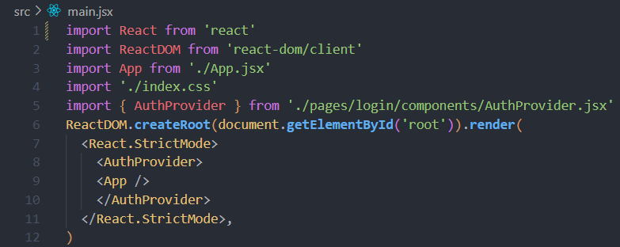

Este código es una aplicación frontend construida con React. Utiliza **`ReactDOM.createRoot`** para renderizar la aplicación en el elemento HTML con id "root". La aplicación está configurada para usar **`<React.StrictMode>`** para activar estrictos avisos y comprobaciones adicionales para ayudar a detectar problemas potenciales en la aplicación. Además, utiliza un componente **`<AuthProvider>`** para proporcionar autenticación a la aplicación envolviendo el componente **`<App>`**.

- **`React`** y **`ReactDOM`** son importados desde los módulos de React.
- **`App`** es importado desde el archivo **`App.jsx`**.
- Se importa un archivo CSS local (**`index.css`**) para los estilos.
- **`AuthProvider`** es importado desde el componente **`AuthProvider.jsx`** para la autenticación.
- **`ReactDOM.createRoot(document.getElementById('root'))`** selecciona el elemento con el id "root" en el HTML donde se renderizará la aplicación.
- **`.render()`** renderiza el contenido de la aplicación.
- **`<React.StrictMode>`** envuelve la aplicación para activar el "Modo Estricto" de React, que ayuda a identificar problemas potenciales en la aplicación.
- **`<AuthProvider>`** es un componente utilizado para proporcionar autenticación a la aplicación.
- **`<App />`** es el componente principal de la aplicación que se renderiza dentro del **`<AuthProvider>`**.

# App.jsx

Este código define un componente funcional llamado **`App`** que utiliza React Router para manejar las rutas y la navegación en una aplicación web. El componente **`App`** renderiza un enrutador (**`Router`**) que contiene un conjunto de rutas (**`Routes`**) definidas por las configuraciones especificadas en **`routes`** dentro de **`utils/routes.js`**. Cada ruta se representa como un componente **`<Route>`** dentro del **`<Routes>`** del enrutador.

- Se importa un archivo CSS local (**`App.css`**) para los estilos del componente.
- Se importan los módulos necesarios de **`react-router-dom`**:
    - **`BrowserRouter as Router`**: Importa **`BrowserRouter`** renombrándolo como **`Router`** para ser utilizado en el componente.
    - **`Route`**: Utilizado para definir rutas individuales dentro del enrutador.
    - **`Routes`**: Contenedor para todas las rutas de la aplicación.
- **`App`** es un componente funcional que renderiza la estructura principal de la aplicación.
- Utiliza **`<Router>`** como componente de enrutamiento principal para manejar las rutas de la aplicación.
- Dentro de **`<Router>`**, se utiliza **`<Routes>`** para definir el conjunto de rutas disponibles en la aplicación.
- **`{routes.map((r) => { ... })}`**: Itera sobre el array **`routes`** definido en **`utils/routes.js`** para generar dinámicamente un conjunto de **`<Route>`** componentes basados en la configuración de cada ruta.
    - **`r.path`**: Define la URL de la ruta.
    - **`r.element`**: Especifica el componente React que se renderizará cuando la ruta coincida.
    - **`key={r.id}`**: Proporciona una clave única para cada ruta, lo que ayuda a React a identificar y manejar los componentes de manera eficiente durante las actualizaciones.
- **`App`** se exporta como el componente predeterminado, lo que permite que otros archivos importen y utilicen este componente como **`import App from './App';`**.

# Routes.jsx

Este código define un array llamado **`routes`** que contiene objetos representando las rutas disponibles en la aplicación. Cada objeto en el array representa una ruta específica con propiedades como **`id`**, **`path`** y **`element`**. Estas propiedades son utilizadas por el componente **`App`** para configurar las rutas en el enrutador (**`Router`**) usando React Router.

- Se importan los componentes **`Home`**, **`Login`**, **`Register`** y **`Game`** desde sus respectivas ubicaciones en el proyecto.
- **`routes`** es un array que contiene objetos, donde cada objeto representa una ruta en la aplicación.
- Cada objeto en **`routes`** tiene las siguientes propiedades:
    - **`id`**: Identificador único de la ruta.
    - **`path`**: URL de la ruta.
    - **`element`**: Componente React asociado a la ruta.
- Cuando la URL coincide con **`/`**, se renderiza el componente **`Home`**.
- Cuando la URL coincide con **`/login`**, se renderiza el componente **`Login`**.
- Cuando la URL coincide con **`/register`**, se renderiza el componente **`Register`**.
- Cuando la URL coincide con **`/game`**, se renderiza el componente **`Game`**

# Links.jsx

Este código define un array llamado **`links`** que contiene objetos representando enlaces de navegación en una barra de navegación, por ejemplo. Cada objeto en el array representa un enlace con propiedades como **`id`**, **`link`** y **`text`**. Estas propiedades son utilizadas para renderizar elementos de navegación en la interfaz de usuario.

- **`links`** es un array que contiene objetos, donde cada objeto representa un enlace de navegación en la interfaz de usuario.
- Cada objeto en **`links`** tiene las siguientes propiedades:
    - **`id`**: Identificador único del enlace.
    - **`link`**: Destino del enlace, generalmente una URL relativa o un identificador.
    - **`text`**: Texto visible del enlace.
- Enlace a "HOME" (**`#inicio`**):
• Este enlace apunta a **`#inicio`** y muestra el texto "HOME".
- Enlace a "ABOUT" (**`#about`**):
• Este enlace apunta a **`#about`** y muestra el texto "ABOUT".
- Enlace a "FAQ" (**`#faq`**):
• Este enlace apunta a **`#faq`** y muestra el texto "FAQ".
- Enlace a "CONTACT" (**`#contact`**)
• Este enlace apunta a **`#contact`** y muestra el texto "CONTACT".

# Axios.jsx

Este código utiliza Axios para crear una instancia de cliente HTTP configurada con una URL base. La instancia de Axios proporciona un cliente HTTP preconfigurado que puede realizar peticiones a la URL base especificada y realizar otras configuraciones adicionales según sea necesario.
• Se importa Axios, una librería para realizar peticiones HTTP desde el navegador o desde Node.js.

- **`axios.create()`** crea una nueva instancia de Axios con una configuración específica.
- **`baseURL: 'http://localhost:8080/'`**: Establece la URL base a la cual se enviarán las peticiones HTTP. En este caso, las peticiones se enviarán a **`http://localhost:8080/`**.
    - La URL base es la parte común de la URL para todas las peticiones realizadas con esta instancia de Axios.

# Register.jsx

Este componente **`Register`** es responsable de renderizar un formulario de registro que permite a los usuarios registrarse en la aplicación. Utiliza múltiples estados para controlar la entrada de usuario, validar los campos del formulario y realizar una solicitud HTTP POST al servidor para registrar nuevos usuarios.

- Importa los módulos y componentes necesarios para el funcionamiento del componente **`Register`**.
- Utiliza **`useRef`**, **`useState`** y **`useEffect`** para manejar referencias, estados y efectos secundarios en el componente.
- Define expresiones regulares (**`USER_REGEX`**, **`PWD_REGEX`**, **`MAIL_REGEX`**) para validar el formato del nombre de usuario, contraseña y correo electrónico.
- **`REGISTER_URL`** especifica la URL a la cual se realizará la solicitud de registro.

- El componente **`Register`** renderiza un formulario de registro con campos para nombre de usuario, contraseña, confirmación de contraseña y correo electrónico.
- Utiliza estados (**`useState`**) para controlar los valores de los campos de entrada y el estado de validación.
- Utiliza **`useRef`** para crear referencias a elementos de entrada y mensajes de error.
- Utiliza **`useEffect`** para manejar efectos secundarios, como establecer el foco en un campo de entrada (**`userRef.current.focus()`**) o validar la entrada cuando cambian los valores (**`useEffect(() => { ... }, [user])`**).
- El método **`handleSubmit`** maneja la lógica de envío del formulario, realizando una solicitud POST al servidor utilizando Axios (**`axios.post(REGISTER_URL, { ... })`**) y gestionando las respuestas y posibles errores.
- El componente renderiza mensajes de error (**`errMsg`**) y un mensaje de éxito si el registro es exitoso (**`success`**). También muestra un enlace para iniciar sesión si el usuario ya está registrado.

El componente **`Register`** utiliza Axios (**`axios`**) para realizar solicitudes HTTP al servidor (**`axios.post`**) y expresiones regulares (**`USER_REGEX`**, **`PWD_REGEX`**, **`MAIL_REGEX`**) para validar los campos del formulario (**`USER_REGEX.test(user)`**, **`PWD_REGEX.test(pwd)`**, **`MAIL_REGEX.test(email)`**

- El componente **`Register`** muestra mensajes de ayuda y validación utilizando íconos (**`FontAwesomeIcon`**) de Font Awesome para indicar la validez de los campos.
- Utiliza **`aria-live="assertive"`** para proporcionar una experiencia accesible al usuario, anunciando mensajes de error importantes a través de tecnologías de asistencia.

# Login.jsx

El componente `Login` implementa un formulario interactivo de inicio de sesión de usuario en una aplicación React. Permite a los usuarios ingresar sus credenciales (correo electrónico y contraseña) para autenticarse en el sistema.

- Importa el componente `Login` en el archivo donde deseamos mostrar el formulario de inicio de sesión:
- Renderiza el componente `Login` dentro del componente principal o en la ruta deseada:
- `email`: Estado que almacena el correo electrónico ingresado por el usuario.
- `pwd`: Estado que almacena la contraseña ingresada por el usuario.
- `errMsg`: Estado que muestra mensajes de error en caso de problemas durante el inicio de sesión.
- `success`: Estado que indica si el inicio de sesión fue exitoso.
- `useState`: Utilizado para definir estados locales en el componente.
- `useRef`: Utilizado para crear referencias a elementos del DOM, como campos de entrada.
- `useEffect`: Utilizado para realizar efectos secundarios, como enfocar un campo al cargar el componente.
- `handleSubmit`: Función que se ejecuta al enviar el formulario de inicio de sesión. Realiza una solicitud HTTP POST al servidor para autenticar al usuario.
- `handleSuccessResponse`: Función que maneja la respuesta exitosa del servidor después de una autenticación exitosa. Actualiza el estado de autenticación global y muestra un mensaje de éxito.
- `handleError`: Función que maneja los errores durante el inicio de sesión, mostrando mensajes de error apropiados según el tipo de error.
- `axios`: Utilizado para realizar peticiones HTTP al servidor de autenticación.
- `AuthContext`: Utilizado para acceder al contexto de autenticación global y actualizar el estado de autenticación después del inicio de sesión.

# AuthProvider.jsx

El contexto de autenticación (`AuthProvider`) proporciona un contexto global en una aplicación React para gestionar el estado de autenticación del usuario.

Para utilizar este contexto de autenticación en una aplicación React:

Encapsula la parte de la aplicación donde necesitamos acceder al estado de autenticación dentro del componente `AuthProvider`.

En los componentes hijos, podemos acceder al estado de autenticación utilizando el hook `useContext` con el contexto `AuthContext`.

- `auth`: Estado que almacena la información de autenticación, como el correo electrónico y el token de acceso.
- `setAuth`: Función utilizada para actualizar el estado de autenticación.
- `AuthProvider`: Componente de proveedor de contexto que envuelve otros componentes para proporcionar acceso al estado de autenticación a través del contexto `AuthContext`.
- `useState`: Utilizado en `AuthProvider` para definir y gestionar el estado de autenticación.
- `createContext`: Utilizado para crear el contexto `AuthContext` que permite compartir datos a través de la jerarquía de componentes.

# Home.jsx

El componente `Home` representa la página de inicio de la aplicación de juegos de damas (`Checkers Elite`). Proporciona una interfaz para que los usuarios se registren o inicien sesión y ofrece información sobre el juego y sus características.

- **`React`**: Importa la librería principal de React para definir componentes.
- **`useNavigate`**: Hook de React Router para gestionar la navegación entre rutas.
- **`Navbar`**: Componente de barra de navegación.
- **`checkers`**: Importa una imagen (**`chekcershome.png`**) como recurso estático.
- **`"./Home.css"`**: Importa estilos CSS para el componente Home.
- **`routes`**: Importa un objeto con las rutas definidas en la aplicación.
- **`navigate`**: Variable que utiliza **`useNavigate()`** para obtener una función de navegación.
- **`navigateToRegister()`**: Función que maneja la navegación hacia la ruta '/register' al hacer clic en el botón "Sign up".
- **`navigateToLogin()`**: Función que maneja la navegación hacia la ruta '/login' al hacer clic en el botón "Login".
- Títulos (**`text1`**, **`text2`**): Textos descriptivos.
- Botones (**`botonlog`**, **`botonsign`**): Botones para iniciar sesión y registrarse, con funciones **`onClick`** que invocan **`navigateToLogin`** y **`navigateToRegister`** respectivamente.
- Secciones (**`page-section1`**, **`page-section2`**, **`section3`**, **`section4`**): Contenedores div con diferentes identificadores para contenido de secciones específicas.
- El componente **`Home`** renderiza una página principal que incluye una barra de navegación (**`Navbar`**), una imagen (**`checkerhome`**) y secciones con contenido y botones interactivos para navegación.
- Al hacer clic en los botones "Login" o "Sign up", se utiliza **`navigate`** para redirigir a las rutas correspondientes ('/login' o '/register').

# Game.jsx

Este componente **`Game`** representa el juego principal de damas dentro de la aplicación. Es responsable de renderizar el tablero de juego utilizando el componente **`Board`**.

- **`React`**: Librería principal de React para definir componentes.
- **`"./Game.css"`**: Archivo de estilos CSS específicos para el componente **`Game`**.
- **`Board`**: Componente que representa el tablero de juego.
- Este componente es una función de React que retorna un elemento JSX.
- Renderiza un contenedor **`
`** con **`id="gamechecker"`**.
- Dentro del contenedor, se incluye el componente **`Board`**, que muestra la interfaz del tablero de damas.

# Board.tsx

El componente **`Board`** es responsable de representar y gestionar el tablero de juego de damas. Este componente utiliza elementos **`Tile`** para renderizar cada casilla del tablero y manejar la interacción con las piezas de juego.

- **`React`**: Importa la librería principal de React para definir componentes.
- **`useRef`**: Hook de React utilizado para acceder al elemento DOM del tablero.
- **`"./Board.css"`** y **`"./Tile/Tile.css"`**: Archivos de estilos CSS para el componente **`Board`** y sus subcomponentes **`Tile`**.
- **`Tile`**: Componente que representa cada casilla del tablero.
- **`piece1`** y **`piece2`**: Importa las imágenes de las piezas del juego.
- **`verticalAxis`** y **`horizontalAxis`**: Definen las coordenadas verticales (y) y horizontales (x) del tablero.
- **`Piece`**: Interfaz que define la estructura de una pieza del juego.
- **`pieces`**: Array que almacena las piezas del juego con sus respectivas posiciones en el tablero.
- **Componente Funcional `Board()`:**
    - Este componente es una función de React que retorna un elemento JSX.
    - Renderiza el tablero de juego con sus cuadrados y piezas correspondientes.
    - Gestiona la interacción del usuario con las piezas a través de eventos de ratón.
    

# Tile.tsx

El componente **`Tile`** representa un cuadrado individual del tablero de juego de damas. Este componente se encarga de renderizar visualmente un cuadrado negro o blanco, dependiendo de su posición en el tablero, y opcionalmente muestra una imagen de una pieza en el cuadrado.

- **`React`**: Importa la librería principal de React para definir componentes.
- **`"./Tile.css"`**: Archivo de estilos CSS específicos para el componente **`Tile`**.
- **`piece1`**, **`piece2`**: Imágenes de las piezas del juego.
- **`image?: string`**: URL de la imagen de la pieza (opcional).
- **`number: number`**: Número que representa la posición del cuadrado en el tablero.
- **Componente Funcional `Tile({number, image}: Props)`:**
    - Este componente es una función de React que retorna un elemento JSX.
    - Renderiza un cuadrado negro o blanco (**`div`**) dependiendo del valor del número.
    - Opcionalmente muestra una imagen de una pieza en el cuadrado si se proporciona una URL de imagen.
    

# Lobby.jsx

El componente **`Lobby`** representa la interfaz de la sala de espera del juego de damas. Este componente permite al usuario elegir entre jugar contra otro usuario en línea, contra la computadora o cerrar sesión.

- **`"./Lobby.css"`**: Archivo de estilos CSS específicos para el componente **`Lobby`**.
- Imágenes importadas para la interfaz (**`imgtablero`**, **`imglinea2`**, **`logocheckers`**, **`robot`**, **`uservsuser`**, **`linev`**, **`logout`**).
- **`useNavigate`** de **`react-router-dom`**: Librería para la navegación entre rutas.
- **Componente Funcional `Lobby()`:**
    - Este componente es una función de React que retorna un elemento JSX.
    - Renderiza la interfaz del lobby con secciones organizadas visualmente.
    - Utiliza botones para permitir al usuario navegar a diferentes rutas y opciones de juego.
- **Secciones del Lobby:**
    - **`section1`**: Muestra una imagen del tablero de damas.
    - **`section2`**: Contiene el logotipo del juego, título y botones de opciones de juego.
        - **`lobby-logo`**: Sección con el logotipo y líneas decorativas.
        - **`lobby-title`**: Título que indica el tipo de juego disponible.
        - **`lobby-options`**: Contenedor de botones para elegir entre jugar en línea o contra la computadora.
            - **`lobby-button1`**: Botón para jugar en línea contra otro usuario.
            - **`lobby-button2`**: Botón para jugar contra la computadora.
    - **`lobby-cierresesion`**: Sección para cerrar sesión con un botón de "Cerrar sesión".
    
# Modal.jsx

El componente **`Modal`** renderiza un modal condicionalmente basado en el estado proporcionado. Este componente permite mostrar o ocultar contenido dentro de un modal en la interfaz.

- **`React`**: Importa la librería principal de React para definir componentes.
- **`"./Modal.css"`**: Archivo de estilos CSS específicos para el componente **`Modal`**.
- **Componente Funcional `Modal({ children, estado, cambiarEstado })`:**
    - Este componente es una función de React que recibe tres propiedades:
        - **`children`**: Contenido del modal que se mostrará cuando **`estado`** sea verdadero.
        - **`estado`**: Estado booleano que indica si el modal debe mostrarse (**`true`**) o no (**`false`**).
        - **`cambiarEstado`**: Función para cambiar el estado del modal.
        

# Personalizartablero.jsx

El componente **`Personalizartablero`** renderiza una sección que contiene botones para abrir y cerrar dos modales (**`Modal`**) diferentes. Cada modal tiene su propio estado (**`estadoModal1`** y **`estadoModal2`**) para controlar su visibilidad.

- **`"./Personalizartab.css"`**: Archivo de estilos CSS específicos para el componente **`Personalizartablero`**.
- **`Modal`**: Componente **`Modal`** importado para mostrar los modales.
- **`React, { useState }`**: Importa la librería React y la función **`useState`** para manejar el estado local del componente.
- **Componente Funcional `Personalizartablero()`:**
    - Este componente es una función de React que utiliza el estado local (**`useState`**) para controlar la visibilidad de los modales.
    - Renderiza botones que, al hacer clic, cambian el estado de los respectivos modales para mostrar u ocultar su contenido.
<h1>Documentacion del Backend</h1>
<h2>1)Clase CorsConfig</h2>

Esta clase es una configuracion de Spring que se encarga de configurar las
reglas de CORS(Cross-Origin Resource Sharing) para una aplicacion web. Ya que CORS es un
mecanismo de seguridad que nos permite restringir las solicitudes HTTP que se realizan desde
un origen diferente al del servidor donde se encuentra la aplicacion web.

<h3>Importaciones de Spring</h3>

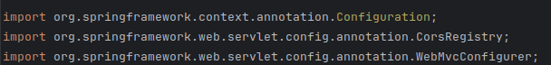

Realizamos las importaciones necesarias

<h3>Clase de configuracion de Spring</h3>

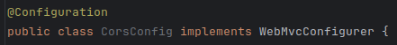

@Configuracion es una anotacion para indicar que esta clase es una configuracion de Spring y ademas
implemento la interfaz WebMvcConfigurer permitiendo personalizar la configuracion de Spring MVC

<h3>Clase de configuracion de Spring</h3>

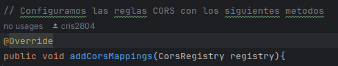

WebMvcConfigurer tiene este metodo como parte de la interfaz y la utiliza para agregar reglas de CORS
al registro

<h3>Configuracion de reglas CORS</h3>

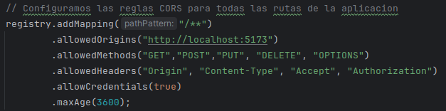

Se configuran las reglas CORS para todas las rutas de la aplicacion, se permite que el origen sea http://localhost:5173,
se especifican los metodos HTTP permitidos, los encabezados permitidos, se permite el uso de credenciales y se estaablece el
tiempo maximo de cache para el preflights OPTIONS a 3600 segundos.

<h3>Configuracion CORS especifica para la ruta /user/**</h3>

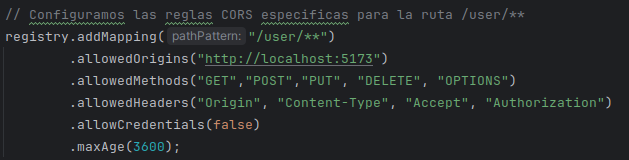

Utilizo esta configuracion especifica para sobreescribir la configuracion global para la ruta /user/**, en este caso se deshabilita
el uso de credenciales, lo que significa que las solicitudes CORS no incluiran cookies de autenticacion u otros datos confidenciales en
las solicitudes

<h2>2)Clase ValidationConfig</h2>

La clase ValidationConfig es una clase de configuración de Spring que se encarga de definir y configurar un bean llamado UserValidation. 
Este bean representa un componente de validación de usuarios en el sistema.

<h3>Importaciones de Spring</h3>

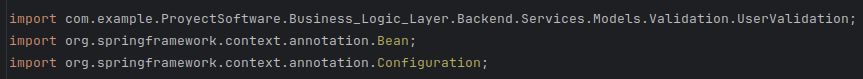

Realizamos las importaciones necesarias

<h3>Definicion del metodo de configuracion</h3>

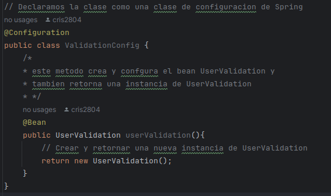

Declaro la clase como una configuraacion de Spring y defino el metodo userValidation() anotado con @Bean, este 
metodo es responsable de crear y configurar un bean de tipo UserValidation dentro del metodo para crear una nueva
instancia de UserValidation y lo retorne

<h2>Clase Usercontroller</h2>
<h3>Importaciones de Spring</h3>

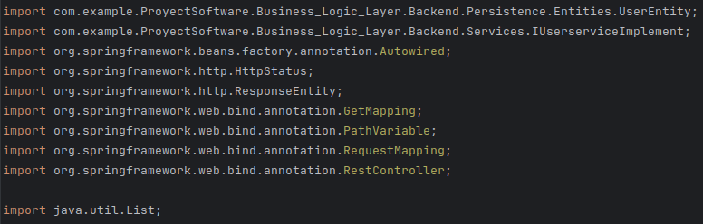

Realizamos las importaciones necesarias

<h3>Definicion de la clase Controladora</h3>

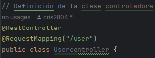

La clase UserController se define como un controlador REST utilizando las anotaciones @RestController y 
@RequestMapping para mapear las solicitudes HTTP a metodos especificos de esta clase.

<h3>Inyeccion de dependencias del servicio de usuario</h3>

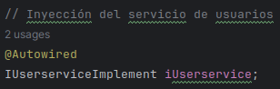

Utilizo la anotacion @Autowired para inyectar una instancia del servicio de usuarios

<h3>Metodo GET para obtener todos los usuarios</h3>

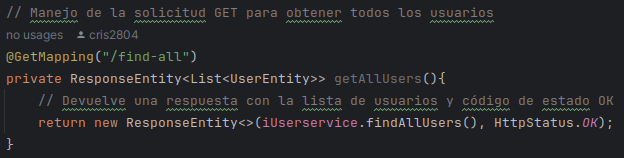

Este metodo maneja una solicitud GET en la ruta /user/find-all y devuelve una lista de todos los usuarios junto
con el codigo de estado HTTP OK(200)

<h3>Metodo GET para obtener un usuario por su ID</h3>

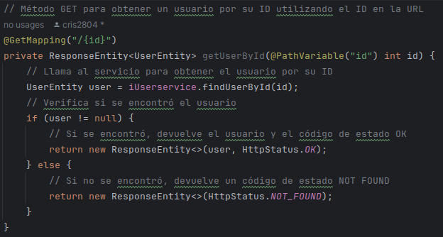

Este metodo maneja una solicitud GET en la ruta /user/{id}, donde {id} es el ID del usuario y devuelve un usuario
especifico por su ID junto con el codigo de estado HTTP OK(200) si se encuentra de lo contrario enviara un codigo
de estado NOT FOUND(404)

<h2>Clase UserControllers</h2>
<h3>Importaciones de Spring</h3>

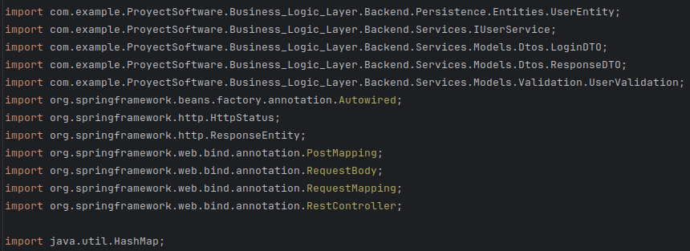

Realizamos las importaciones necesarias

<h3>Definicion del controllador REST y mapeo de la ruta base</h3>

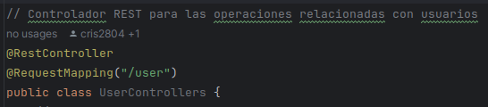

Defino la clase UserControllers como un controlador REST y mapea la ruta base /user
para todas las operaciones relacionadas con usuarios

<h3>Inyeccion del servicio de usuarios</h3>

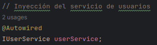

Utilizo la anotacion @Autowired para inyectar una instancia del servicio de usuarios IUserService en el controlador

<h3>Metodo para registrar un usuario</h3>

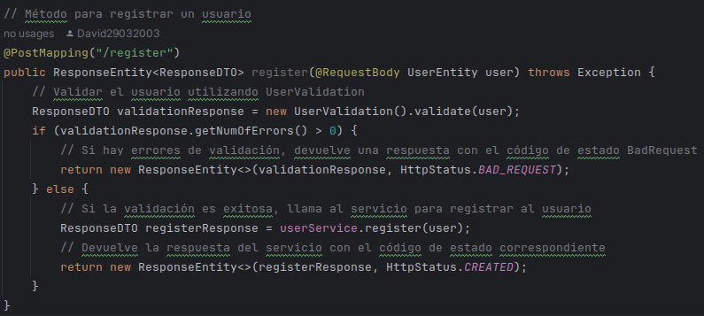

Este método maneja una solicitud POST en la ruta /user/register para registrar un nuevo usuario. Se valida el usuario utilizando 
la clase UserValidation, en caso hay errores de validación, se devuelve una respuesta con el código de estado BadRequest (400). 
en caso la validación es exitosa, se llama al servicio para registrar al usuario y se devuelve la respuesta del servicio con el código 
de estado CREATED (201).

<h3>Metodo para realizar el inicio de sesion de un usuario</h3>

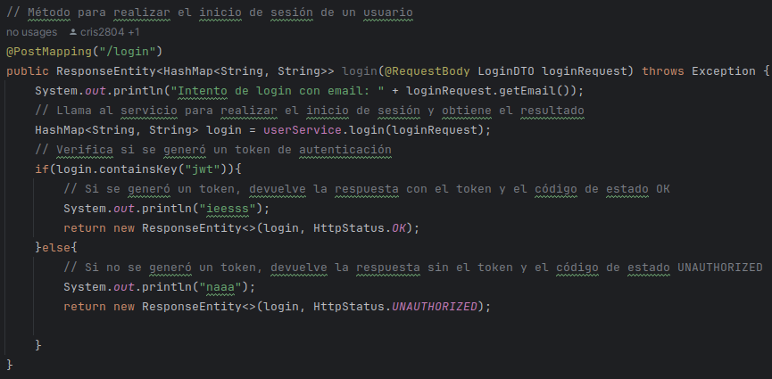

Este método maneja una solicitud POST en la ruta /user/login para realizar el inicio de sesión de un usuario, lo que hace es Llamar al servicio 
para realizar el inicio de sesión y obtiene el resultado. Si se genera un token de autenticación, devuelve la respuesta con el token 
y el código de estado OK (200). Si no se genera un token, devuelve la respuesta sin el token y el código de estado UNAUTHORIZED (401).

<h2>Clase UserEntity</h2>

la clase UserEntity representa una entidad JPA que mapea los datos de usuarios a una tabla en la base de datos. Utiliza Lombok para generar 
automáticamente los métodos getters, setters y constructores, y proporciona anotaciones de JPA para definir la estructura de la tabla y sus 
relaciones con los atributos de la clase.

<h3>Importaciones de Spring</h3>

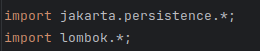

Realizamos las importaciones necesarias

<h3>Anotaciones de Lombok y JPA</h3>

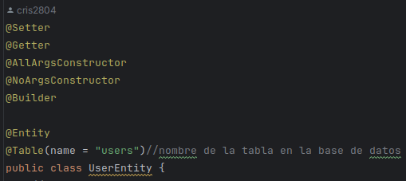

@Setter, @Getter, @AllArgsConstructor, @NoArgsConstructor y @Builder: Estas anotaciones son proporcionadas por Lombok, una biblioteca de Java que 
permite generar automáticamente los métodos getters, setters, constructores y otros métodos comunes. @Setter y @Getter generan automáticamente los 
métodos setter y getter para todos los campos de la clase. @AllArgsConstructor genera un constructor con todos los campos de la clase como parámetros. 
@NoArgsConstructor genera un constructor sin argumentos. @Builder permite la construcción de objetos utilizando el patrón de diseño Builder.
@Entity: Indica que la clase es una entidad JPA y está mapeada a una tabla en la base de datos, @Table(name = "users"): Especifica el nombre de la tabla 
en la base de datos a la que está mapeada la entidad.

<h3>Anotaciones de JPA para los atributos</h3>

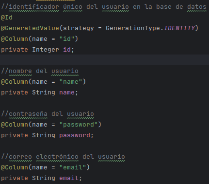

@Id Indica que el atributo es la clave primaria de la entidad, @GeneratedValue(strategy = GenerationType.IDENTITY) especifica la estrategia de generación 
de valores para la clave primaria. En este caso, se utiliza la identidad de la base de datos para generar valores automáticamente 
@Column(name = "nombre de la columna") especifica el nombre de la columna en la tabla de la base de datos a la que está mapeado el atributo.

<h3>Metodos Getters y Setters</h3>

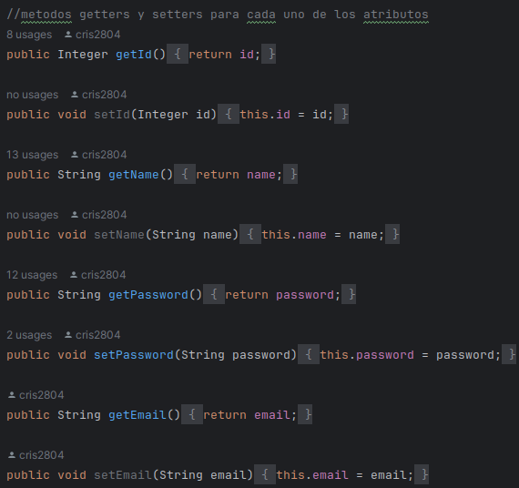

Se proporcionan métodos getters y setters para cada uno de los atributos de la clase para acceder y modificar sus valores.

<h2>Interfaz UserRepository</h2>

la interfaz UserRepository define métodos personalizados para buscar usuarios en la base de datos utilizando consultas SQL nativas. Estos métodos 
permiten buscar usuarios por correo electrónico y nombre de usuario.

<h3>Importaciones de Spring</h3>

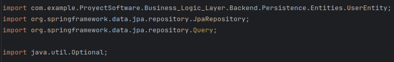

Realizamos las importaciones necesarias

<h3>Declaracion de la interfaz</h3>

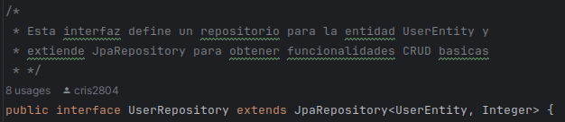

Esta línea declara la interfaz UserRepository, que extiende la interfaz JpaRepository. La interfaz JpaRepository es proporcionada por Spring 
Data JPA y proporciona métodos CRUD estándar para interactuar con la base de datos.

<h3>Metodo findByEmail</h3>

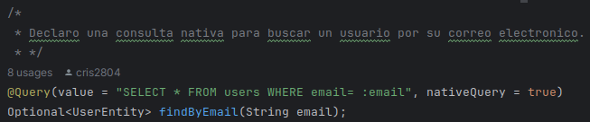

@Query(value = "SELECT * FROM users WHERE email= :email", nativeQuery = true): Esta anotación @Query indica que se realizará una consulta nativa a la base 
de datos para buscar un usuario por su correo electrónico. La consulta SQL se especifica como un valor de cadena, donde :email es un parámetro que se pasará a la consulta.
Optional<UserEntity>: El método devuelve un objeto Optional que contiene un UserEntity si se encuentra un usuario con el correo electrónico especificado, o un objeto Optional vacío si no se encuentra ningún usuario.

<h3>Metodo findByName</h3>

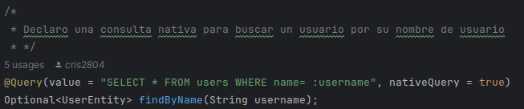

Similar al método findByEmail, esta anotación @Query indica que se realizará una consulta nativa para buscar un usuario por su nombre de usuario.
El método devuelve un objeto Optional que contiene un UserEntity si se encuentra un usuario con el nombre de usuario especificado, o un objeto 
Optional vacío si no se encuentra ningún usuario.

# Clase JWTAuthorizationFilter

La clase **`JWTAuthorizationFilter`** es un filtro de seguridad utilizado para autorizar las solicitudes HTTP mediante el uso de tokens JWT (JSON Web Tokens).

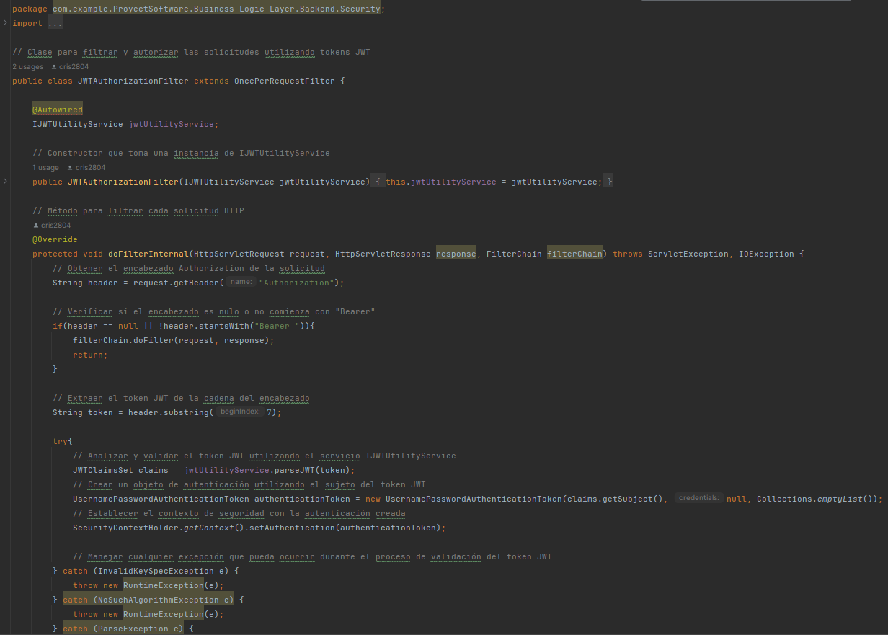

- **Paquete:**
    - **`com.example.ProyectSoftware.Business_Logic_Layer.Backend.Security`**: Ubicación del archivo en el paquete de seguridad del backend.
- **Importaciones:**
    - **`com.example.ProyectSoftware.Business_Logic_Layer.Backend.Services.IJWTUtilityService`**: Importa la interfaz **`IJWTUtilityService`** del servicio de utilidad JWT.
    - **`com.nimbusds.jose.JOSEException`**: Maneja excepciones relacionadas con JOSE (Java Object Signing and Encryption).
    - **`com.nimbusds.jwt.JWTClaimsSet`**: Representa un conjunto de reclamaciones (claims) de un token JWT.
    - **`jakarta.servlet.FilterChain`**: Proporciona una forma de invocar el siguiente filtro en una cadena de filtros.
    - **`jakarta.servlet.ServletException`**: Excepción lanzada por métodos en el ciclo de vida del servlet.
    - **`jakarta.servlet.http.HttpServletRequest`**: Proporciona métodos para obtener información sobre una solicitud HTTP.
    - **`jakarta.servlet.http.HttpServletResponse`**: Proporciona métodos para manejar una respuesta HTTP.
    - **`org.springframework.beans.factory.annotation.Autowired`**: Anotación utilizada para inyectar dependencias en Spring.
    - **`org.springframework.security.authentication.UsernamePasswordAuthenticationToken`**: Representa una solicitud de autenticación con nombre de usuario y contraseña.
    - **`org.springframework.security.core.context.SecurityContextHolder`**: Proporciona acceso al contexto de seguridad de Spring.
- **Extensión:**
    - **`OncePerRequestFilter`**: Clase base para filtros que deben aplicarse una vez por cada solicitud.
- **Metodo `doFilterInternal(HttpServletRequest, HttpServletResponse, FilterChain)`:**
    - Método principal que implementa la lógica de filtrado para cada solicitud HTTP.
    - Obtiene el encabezado **`Authorization`** de la solicitud y extrae el token JWT.
    - Valida y analiza el token JWT utilizando el servicio **`IJWTUtilityService`**.
    - Crea un objeto de autenticación (**`UsernamePasswordAuthenticationToken`**) basado en el sujeto del token JWT.
    - Establece el contexto de seguridad (**`SecurityContextHolder`**) con la autenticación creada.
    - Captura y maneja excepciones relacionadas con la validación del token JWT.
    - Continúa con el siguiente filtro en la cadena de filtros después de la validación.
- **Constructor:**
    - Recibe una instancia de **`IJWTUtilityService`** como parámetro.
    - Inyecta la dependencia **`jwtUtilityService`** utilizando la anotación **`@Autowired`**.

# Clase SecurityConfig

La clase **`SecurityConfig`** define la configuración de seguridad de Spring para gestionar la autenticación y autorización de las solicitudes HTTP en una aplicación web.

- **Paquete:**
    - **`com.example.ProyectSoftware.Business_Logic_Layer.Backend.Security`**: Ubicación del archivo en el paquete de seguridad del backend.
- **Importaciones:**
    - **`com.example.ProyectSoftware.Business_Logic_Layer.Backend.Services.IJWTUtilityService`**: Importa la interfaz **`IJWTUtilityService`** del servicio de utilidad JWT.
    - **`jakarta.servlet.http.HttpServletResponse`**: Proporciona métodos para manejar una respuesta HTTP.
    - **`org.springframework.beans.factory.annotation.Autowired`**: Anotación utilizada para inyectar dependencias en Spring.
    - **`org.springframework.context.annotation.Bean`**: Anotación para definir un método que expone un bean de Spring.
    - **`org.springframework.context.annotation.Configuration`**: Anotación que indica que una clase define una configuración de Spring.
    - **`org.springframework.security.config.annotation.method.configuration.EnableMethodSecurity`**: Habilita la seguridad a nivel de método.
    - **`org.springframework.security.config.annotation.web.builders.HttpSecurity`**: Configura la seguridad a nivel de HTTP.
    - **`org.springframework.security.config.annotation.web.configuration.EnableWebSecurity`**: Habilita la configuración de seguridad web.
    - **`org.springframework.security.config.http.SessionCreationPolicy`**: Enumeración que representa las políticas de creación de sesiones.
    - **`org.springframework.security.crypto.bcrypt.BCryptPasswordEncoder`**: Implementación de **`PasswordEncoder`** que utiliza el algoritmo BCrypt para el cifrado de contraseñas.
    - **`org.springframework.security.crypto.password.PasswordEncoder`**: Interfaz para codificar y verificar contraseñas.
- **Metodo `securityFilterChain(HttpSecurity)`:**
    - Método anotado con **`@Bean`** que configura el filtro de seguridad para las solicitudes HTTP.
    - Deshabilita la protección CSRF.
    - Define reglas de autorización para las solicitudes HTTP.
    - Configura la gestión de sesiones como **`STATELESS`** (sin estado).
    - Agrega el filtro **`JWTAuthorizationFilter`** antes del filtro de autenticación **`UsernamePasswordAuthenticationFilter`**.
    - Maneja excepciones de autenticación para responder con un código de estado **`UNAUTHORIZED`**.
- **Metodo `passwordEncoder()`:**
    - Método anotado con **`@Bean`** que expone un bean de Spring para proporcionar un codificador de contraseñas **`BCryptPasswordEncoder`**.

# Clase TokenManager

La clase **`TokenManager`** es responsable de gestionar y mantener los tokens activos asociados a cada usuario en una aplicación. Proporciona métodos para almacenar, eliminar y verificar la validez de los tokens JWT.

- **Paquete:**
    - **`com.example.ProyectSoftware.Business_Logic_Layer.Backend.Security`**: Ubicación del archivo en el paquete de seguridad del backend.
- **Importaciones:**
    - **`org.springframework.stereotype.Component`**: Anotación que indica que la clase es un componente de Spring y debe ser escaneada por el contexto de la aplicación.
- **`activeTokens`:**
    - **`Map<Integer, String>`**: Mapa que almacena los tokens activos asociados a cada usuario, donde la clave es el ID del usuario y el valor es el token JWT.
- **Metodo `storeTokenInActiveTokens(int userId, String jwt)`:**
    - Almacena el token JWT asociado a un usuario en la lista de tokens activos.
    - Parámetros:
        - **`userId`**: ID del usuario.
        - **`jwt`**: Token JWT a almacenar.
- **Metodo `removeTokenFromActiveTokens(int userId)`:**
    - Elimina el token asociado a un usuario de la lista de tokens activos.
    - Parámetro:
        - **`userId`**: ID del usuario cuyo token debe eliminarse.
- **Metodo `isTokenActive(int userId, String jwt)`:**
    - Verifica si un token está activo para un usuario específico.
    - Retorna **`true`** si el token es válido y está asociado al usuario especificado.
    - Parámetros:
        - **`userId`**: ID del usuario.
        - **`jwt`**: Token JWT a verificar.

# Clase LoginDTO

La clase **`LoginDTO`** representa un DTO (Objeto de Transferencia de Datos) utilizado para el proceso de inicio de sesión de un usuario. Contiene los campos necesarios para el correo electrónico y la contraseña del usuario.

- **Paquete:**
    - **`com.example.ProyectSoftware.Business_Logic_Layer.Backend.Services.Models.Dtos`**: Ubicación de la clase en el paquete de modelos de DTO del servicio de backend.
- Atributos:
    - **`email`:**
        - Tipo: **`String`**
        - Descripción: Campo que almacena el correo electrónico del usuario.
    - **`password`:**
        - Tipo: **`String`**
        - Descripción: Campo que almacena la contraseña del usuario.
- **`LoginDTO()`:**
    - Descripción: Constructor predeterminado sin parámetros.
- **`LoginDTO(String email, String password)`:**
    - Descripción: Constructor que inicializa un objeto **`LoginDTO`** con el correo electrónico y la contraseña especificados.
    - Parámetros:
        - **`email`**: Correo electrónico del usuario.
        - **`password`**: Contraseña del usuario.
- **Metodo `getEmail()`:**
    - Descripción: Retorna el correo electrónico almacenado en el DTO.
    - Retorno: **`String`**
- **Metodo `setEmail(String email)`:**
    - Descripción: Establece el correo electrónico en el DTO.
    - Parámetros:
        - **`email`**: Nuevo correo electrónico a establecer.
- **Metodo `getPassword()`:**
    - Descripción: Retorna la contraseña almacenada en el DTO.
    - Retorno: **`String`**
- **Metodo `setPassword(String password)`:**
    - Descripción: Establece la contraseña en el DTO.
    - Parámetros:
        - **`password`**: Nueva contraseña a establecer.

# Clase ResponseDTO

La clase **`ResponseDTO`** representa un DTO (Objeto de Transferencia de Datos) utilizado para encapsular la respuesta de una API. Contiene información sobre el número de errores ocurridos y un mensaje descriptivo asociado con la respuesta.

- **Paquete:**
    - **`com.example.ProyectSoftware.Business_Logic_Layer.Backend.Services.Models.Dtos`**: Ubicación de la clase en el paquete de modelos de DTO del servicio de backend.
- Atributos
    - **`numOfErrors`:**
        - Tipo: **`int`**
        - Descripción: Número de errores asociados con la respuesta.
    - **`message`:**
        - Tipo: **`String`**
        - Descripción: Mensaje descriptivo relacionado con la respuesta.
- **`ResponseDTO()`:**
    - Descripción: Constructor predeterminado sin parámetros.
- **Metodo `getNumOfErrors()`:**
    - Descripción: Retorna el número de errores almacenado en el DTO.
    - Retorno: **`int`**
- **Metodo `setNumOfErrors(int numOfErrors)`:**
    - Descripción: Establece el número de errores en el DTO.
    - Parámetros:
        - **`numOfErrors`**: Nuevo número de errores a establecer.
- **Metodo `getMessage()`:**
    - Descripción: Retorna el mensaje descriptivo almacenado en el DTO.
    - Retorno: **`String`**
- **Metodo `setMessage(String message)`:**
    - Descripción: Establece el mensaje descriptivo en el DTO.
    - Parámetros:
        - **`message`**: Nuevo mensaje descriptivo a establecer.

# Clase UserValidation

La clase **`UserValidation`** es responsable de realizar la validación de los campos de un objeto **`UserEntity`** según ciertos criterios predefinidos. Utiliza un objeto **`ResponseDTO`** para almacenar el resultado de la validación, incluyendo el número de errores encontrados y un mensaje descriptivo asociado.

- **Paquete:**
    - **`com.example.ProyectSoftware.Business_Logic_Layer.Backend.Services.Models.Validation`**: Ubicación de la clase en el paquete de validación del modelo del servicio de backend.

La clase **`UserValidation`** implementa la validación de los siguientes campos del objeto **`UserEntity`**:

- **Campo `name`:**
    - Requisitos:
        - No puede ser nulo.
        - Debe tener entre 3 y 15 caracteres.
    - Mensaje de Error: "El campo nombre no puede ser nulo y debe tener entre 3 y 15 caracteres."
- **Campo `email`:**
    - Requisitos:
        - No puede ser nulo.
        - Debe tener un formato válido de dirección de correo electrónico.
    - Mensaje de Error: "El campo email no es válido."
- **Campo `password`:**
    - Requisitos:
        - No puede ser nulo.
        - Debe tener entre 8 y 16 caracteres.
        - Debe contener al menos un número, una letra minúscula y una letra mayúscula.
    - Mensaje de Error: "La contraseña debe tener entre 8 y 16 caracteres, al menos un número, una letra minúscula y una letra mayúscula."
- **Metodo `validate(UserEntity user)`:**
    - Descripción: Método utilizado para validar un objeto **`UserEntity`** con respecto a ciertos criterios.
    - Parámetros:
        - **`user`**: Objeto **`UserEntity`** que se va a validar.
    - Retorno: **`ResponseDTO`**
        - Objeto **`ResponseDTO`** que contiene el resultado de la validación, incluyendo el número de errores y un mensaje descriptivo.

# Interfaz IJWTUtilityService

La interfaz **`IJWTUtilityService`** define métodos para generar y analizar tokens JWT (JSON Web Tokens) dentro del contexto de un servicio en la capa de lógica de negocio del backend.

- **Paquete:**
    - **`com.example.ProyectSoftware.Business_Logic_Layer.Backend.Services`**: Ubicación de la interfaz en el paquete de servicios del backend.
- **Metodo `generateJWT(Integer id) throws IOException, NoSuchAlgorithmException, InvalidKeySpecException, JOSEException`:**
    - Descripción: Método para generar un token JWT dado un ID específico.
    - Parámetros:
        - **`id`**: Identificador único asociado al token JWT.
    - Excepciones:
        - **`IOException`**: Excepción de E/S que puede ocurrir durante la generación del token.
        - **`NoSuchAlgorithmException`**: Excepción que indica un algoritmo no válido para la generación del token.
        - **`InvalidKeySpecException`**: Excepción que indica una especificación de clave inválida durante la generación del token.
        - **`JOSEException`**: Excepción relacionada con errores en la biblioteca JOSE (JSON Object Signing and Encryption).
    - Retorno: **`String`**
        - Token JWT generado como una cadena de caracteres.
- **Metodo `parseJWT(String jwt) throws IOException, InvalidKeySpecException, NoSuchAlgorithmException, ParseException, JOSEException`:**
    - Descripción: Método para analizar y validar un token JWT dado.
    - Parámetros:
        - **`jwt`**: Token JWT que se va a analizar y validar.
    - Excepciones:
        - **`IOException`**: Excepción de E/S que puede ocurrir durante el análisis del token.
        - **`InvalidKeySpecException`**: Excepción que indica una especificación de clave inválida durante el análisis del token.
        - **`NoSuchAlgorithmException`**: Excepción que indica un algoritmo no válido para el análisis del token.
        - **`ParseException`**: Excepción que indica un error durante el análisis de la estructura del token.
        - **`JOSEException`**: Excepción relacionada con errores en la biblioteca JOSE (JSON Object Signing and Encryption).
    - Retorno: **`JWTClaimsSet`**
        - Objeto que representa las afirmaciones (claims) extraídas del token JWT analizado y validado.

# Interfaz IUserService

La interfaz **`IUserService`** define métodos para gestionar usuarios dentro del contexto del servicio en la capa de lógica de negocio del backend.

- **Paquete:**
    - **`com.example.ProyectSoftware.Business_Logic_Layer.Backend.Services`**: Ubicación de la interfaz en el paquete de servicios del backend.
- **Metodo `login(LoginDTO login) throws Exception`:**
    - Descripción: Método para realizar el inicio de sesión de un usuario.
    - Parámetros:
        - **`login`**: DTO (Objeto de Transferencia de Datos) que contiene el correo electrónico y la contraseña del usuario.
    - Excepciones:
        - **`Exception`**: Excepción genérica que puede ocurrir durante el proceso de inicio de sesión.
- **Metodo `register(UserEntity user) throws Exception`:**
    - Descripción: Método para registrar un nuevo usuario.
    - Parámetros:
        - **`user`**: Entidad que representa los datos del usuario a registrar.
    - Excepciones:
        - **`Exception`**: Excepción genérica que puede ocurrir durante el proceso de registro de usuario.
- **Metodo `registerTest(UserEntity user) throws Exception`:**
    - Descripción: Método de prueba para registrar un usuario (no utilizado en producción).
    - Parámetros:
        - **`user`**: Entidad que representa los datos del usuario a registrar.
    - Excepciones:
        - **`Exception`**: Excepción genérica que puede ocurrir durante el proceso de registro de usuario.

# Interfaz IUserserviceImplement

La interfaz **`IUserserviceImplement`** define métodos para la gestión y consulta de usuarios dentro del contexto del servicio en la capa de lógica de negocio del backend.

- **Paquete:**
    - **`com.example.ProyectSoftware.Business_Logic_Layer.Backend.Services`**: Ubicación de la interfaz en el paquete de servicios del backend.
- **Metodo `findAllUsers() : List<UserEntity>`**
    - Descripción: Método para obtener todos los usuarios registrados en el sistema.
    - Retorna: Lista de entidades **`UserEntity`** que representan a todos los usuarios.
- **Metodo `findUserByName(String username) : UserEntity`**
    - Descripción: Método para obtener un usuario por su nombre de usuario.
    - Parámetros:
        - **`username`**: Nombre de usuario del usuario a buscar.
    - Retorna: Entidad **`UserEntity`** correspondiente al usuario encontrado.
- **Metodo `findUserById(int id) : UserEntity`**
    - Descripción: Método para obtener un usuario por su identificador único (ID).
    - Parámetros:
        - **`id`**: Identificador único del usuario a buscar.
    - Retorna: Entidad **`UserEntity`** correspondiente al usuario encontrado por su ID.

# Clase JWTUtilityServiceImpl

La clase **`JWTUtilityServiceImpl`** implementa la interfaz **`IJWTUtilityService`** para proporcionar funcionalidades relacionadas con la generación, análisis y validación de tokens JWT utilizando algoritmos de firma RSA.

- **Paquete:**
    - **`com.example.ProyectSoftware.Business_Logic_Layer.Backend.Services`**: Ubicación de la clase en el paquete de servicios del backend.
- **`@Service`**
    - Indica que esta clase es un componente de servicio de Spring.
- **`privateKeyResource` (Resource)**
    - Recurso que representa la clave privada utilizada para firmar los tokens JWT.
- **`publicKeyResource` (Resource)**
    - Recurso que representa la clave pública utilizada para verificar y validar los tokens JWT.
- **Metodo `generateJWT(Integer id) : String`**
    - Descripción: Método para generar un token JWT utilizando el ID proporcionado como sujeto del token.
    - Parámetros:
        - **`id`**: Identificador único asociado al sujeto del token.
    - Retorna: Token JWT generado como una cadena serializada.
- **Metodo `parseJWT(String jwt) : JWTClaimsSet`**
    - Descripción: Método para analizar y validar un token JWT dado.
    - Parámetros:
        - **`jwt`**: Token JWT en forma de cadena a analizar y validar.
    - Retorna: Objeto **`JWTClaimsSet`** que contiene los claims (datos) del token JWT analizado y validado.
- **Metodo `loadPrivateKey(Resource resource) : PrivateKey`**
    - Descripción: Método privado para cargar la clave privada desde un recurso.
    - Parámetros:
        - **`resource`**: Recurso que representa el archivo que contiene la clave privada.
    - Retorna: Clave privada (**`PrivateKey`**) generada a partir del recurso especificado.
- **Metodo `loadPublicKey(Resource resource) : PublicKey`**
    - Descripción: Método privado para cargar la clave pública desde un recurso.
    - Parámetros:
        - **`resource`**: Recurso que representa el archivo que contiene la clave pública.
    - Retorna: Clave pública (**`PublicKey`**) generada a partir del recurso especificado.

# Clase: UserServiceImpl

La clase **`UserServiceImpl`** implementa la interfaz **`IUserService`** para proporcionar funcionalidades relacionadas con la autenticación y registro de usuarios, utilizando repositorios de persistencia, validaciones y servicios de tokens JWT.

- **Paquete:**
    - **`com.example.ProyectSoftware.Business_Logic_Layer.Backend.Services`**: Ubicación de la clase en el paquete de servicios del backend.
- **`@Service`**
    - Indica que esta clase es un componente de servicio de Spring.
- **`userRepository` (UserRepository)**
    - Repositorio utilizado para acceder y manipular entidades de usuario en la base de datos.
- **`jwtUtilityService` (IJWTUtilityService)**
    - Servicio utilizado para generar y analizar tokens JWT.
- **`userValidation` (UserValidation)**
    - Validador utilizado para verificar la validez de los datos de usuario antes de su registro.
- **`tokenManager` (TokenManager)**
    - Gestor utilizado para almacenar y verificar tokens asociados a usuarios activos.
- **Metodo `login(LoginDTO login) : HashMap<String, String>`**
    - Descripción: Método para autenticar a un usuario con las credenciales proporcionadas.
    - Parámetros:
        - **`login`**: DTO que contiene el correo electrónico y la contraseña del usuario.
    - Retorna: Un mapa (**`HashMap`**) que contiene el resultado de la autenticación (JWT si es exitosa).
- **Metodo `register(UserEntity user) : ResponseDTO`**
    - Descripción: Método para registrar un nuevo usuario en el sistema.
    - Parámetros:
        - **`user`**: Entidad **`UserEntity`** que representa al usuario a registrar.
    - Retorna: DTO de respuesta (**`ResponseDTO`**) que indica el resultado del registro.
- **Metodo `registerTest(UserEntity user) : ResponseDTO`**
    - Descripción: Método para registrar un nuevo usuario en el sistema (versión de prueba).
    - Parámetros:
        - **`user`**: Entidad **`UserEntity`** que representa al usuario a registrar.
    - Retorna: DTO de respuesta (**`ResponseDTO`**) que indica el resultado del registro (versión de prueba).
- **Metodo `verifyPassword(String enteredPassword, String storedPassword) : boolean`**
    - Descripción: Método para verificar si la contraseña ingresada coincide con la contraseña almacenada (utilizando bcrypt).
    - Parámetros:
        - **`enteredPassword`**: Contraseña ingresada por el usuario.
        - **`storedPassword`**: Contraseña almacenada en la base de datos (codificada).
    - Retorna: **`true`** si las contraseñas coinciden, **`false`** si no coinciden.

# Clase UserServiceImplement

La clase **`UserServiceImplement`** implementa la interfaz **`IUserserviceImplement`** para proporcionar funcionalidades relacionadas con la gestión y recuperación de usuarios mediante el uso del repositorio de persistencia.

- **Paquete:**
    - **`com.example.ProyectSoftware.Business_Logic_Layer.Backend.Services`**: Ubicación de la clase en el paquete de servicios del backend.
- **`@Service`**
    - Indica que esta clase es un componente de servicio de Spring.
- **`userRepository` (UserRepository)**
    - Repositorio utilizado para acceder y manipular entidades de usuario en la base de datos.
- **Metodo `findAllUsers() : List<UserEntity>`**
    - Descripción: Método para obtener todos los usuarios registrados en el sistema.
    - Retorna: Una lista (**`List`**) de entidades **`UserEntity`** que representan todos los usuarios almacenados en la base de datos.
- **Metodo `findUserByName(String username) : UserEntity`**
    - Descripción: Método para obtener un usuario por su nombre de usuario.
    - Parámetros:
        - **`username`**: Nombre de usuario del usuario que se desea recuperar.
    - Retorna: La entidad **`UserEntity`** correspondiente al usuario con el nombre de usuario especificado, o **`null`** si no se encuentra ningún usuario con ese nombre.
- **Metodo `findUserById(int id) : UserEntity`**
    - Descripción: Método para obtener un usuario por su identificador único (ID).
    - Parámetros:
        - **`id`**: Identificador único del usuario que se desea recuperar.
    - Retorna: La entidad **`UserEntity`** correspondiente al usuario con el ID especificado, o **`null`** si no se encuentra ningún usuario con ese ID.
</body>
</html>
